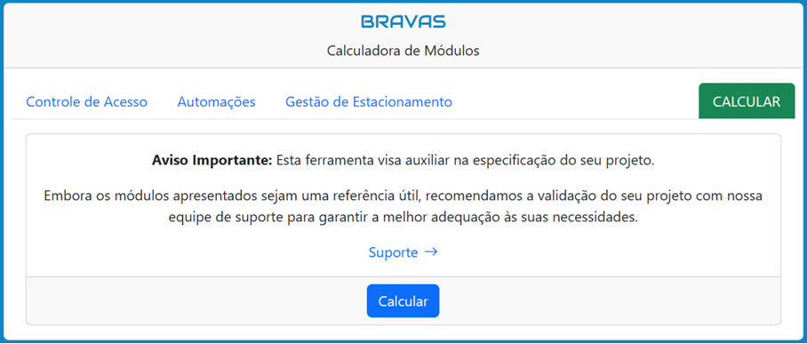
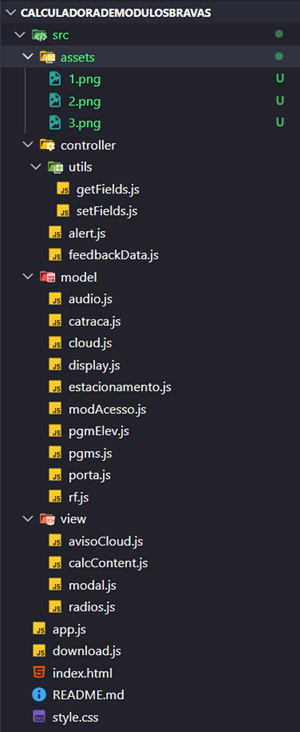

# Calculadora de Módulos BRAVAS — v2

🔗 **GitHub Pages:**  
[Clique aqui para acessar a aplicação](https://danilodoes.github.io/calculadorademodulosbravas/)

🔗 **Versão em produção (BRAVAS):**  
[Clique aqui para visualizar o projeto em funcionamento](https://www.bravas.ind.br/calculadora/)

---

## 📌 Sobre o Projeto

A **Calculadora de Módulos BRAVAS** é uma aplicação web desenvolvida para **auxiliar no dimensionamento de módulos de comando** utilizados em projetos de **Controle de Acesso**, **Automação** e **Gestão de Estacionamentos**.

O objetivo principal da ferramenta é **eliminar cálculos manuais**, reduzir erros de dimensionamento e **fornecer uma estimativa rápida e confiável** da quantidade de módulos necessários, com base nas regras de negócio e na arquitetura dos equipamentos BRAVAS.

Essa nova versão representa uma evolução significativa em relação à versão original, trazendo melhorias tanto na **experiência do usuário (UI/UX)** quanto na **estrutura e qualidade do código**.

---

## 🎯 Objetivos

- **Otimizar o Dimensionamento:** Automatizar o cálculo de módulos, reduzindo tempo e complexidade.
- **Aumentar a Precisão:** Minimizar falhas humanas em projetos de automação e controle de acesso.
- **Melhorar a Experiência do Usuário:** Oferecer uma interface mais intuitiva, limpa e direta.
- **Facilitar Manutenção e Evolução:** Refatorar e modularizar o código, tornando-o mais organizado e escalável.
- **Aplicar Boas Práticas de Desenvolvimento:** Consolidar conceitos de componentização, separação de responsabilidades e legibilidade de código.

---

## ✨ Principais Melhorias da v2

### 🖥️ Interface e Experiência do Usuário

- **Formulário Unificado:**  
  Todos os campos de entrada agora estão disponíveis em uma única tela, eliminando o fluxo em formato de carrossel da versão anterior.

- **Navegação por Tabs:**  
  A calculadora foi reorganizada em abas (tabs), permitindo que o usuário visualize e navegue diretamente entre as categorias:
  - **Controle de Acesso**
  - **Automação**
  - **Gestão de Estacionamento**

- **Visualização Direta das Categorias:**  
  O usuário pode identificar rapidamente cada seção pelo *nome da aba*, tornando a interação mais intuitiva, objetiva e limpa.

- **Interface Mais Clara e Moderna:**  
  Redução de passos desnecessários e melhor organização visual dos inputs.

---

### 🆕 Atualização de Produtos

- Inclusão de **produtos de lançamento previstos para 2026**, permitindo que o cálculo já considere a nova linha de equipamentos da BRAVAS.

---

### 🛠️ Arquitetura e Código

- **Refatoração Completa do Código**
- **Modularização:**  
  O código foi dividido em múltiplos arquivos JavaScript, separando responsabilidades de forma clara.

- **Componentização:**  
  Cada script busca representar **uma funcionalidade específica**, seguindo o princípio de:
  - *Uma responsabilidade por função*
  - *Uma funcionalidade por arquivo*

- **Maior Legibilidade e Manutenção:**  
  A nova estrutura facilita:
  - Leitura do código
  - Correções futuras
  - Inclusão de novas regras de negócio
  - Evolução da aplicação sem gerar complexidade excessiva

---

## ⚙️ Funcionalidades

- **Cálculo Automático de Módulos:**  
  A partir dos dados informados, a aplicação determina quais e quantos módulos são necessários para o projeto.

- **Separação por Categoria:**  
  Cálculos organizados conforme o tipo de solução (Acesso, Automação ou Estacionamento).

- **Feedback Imediato:**  
  O resultado do dimensionamento é exibido logo após o cálculo.

- **Geração de Relatório em PDF:**  
  Possibilidade de exportar um relatório contendo:
  - Dados informados pelo usuário
  - Resultado do cálculo
  
---

## 🔍 Como Funciona

> **A aplicação opera com base nas regras de negócio dos equipamentos BRAVAS**

1. **Entrada de Dados:**  
   O usuário preenche o formulário conforme os recursos que deseja controlar (portas, catracas, automações, etc.).

2. **Processamento:**  
   O JavaScript aplica as regras de dimensionamento, simulando a capacidade dos módulos e a arquitetura eletrônica necessária.

3. **Resultado:**  
   A aplicação apresenta:
   - Lista de módulos necessários
   - Quantidade de cada módulo
   - Relatório em PDF com o resumo do cálculo

---

## 🧪 Tecnologias Utilizadas

- **HTML5** — Estrutura da aplicação
- **CSS3 + Bootstrap** — Estilização
- **JavaScript (Vanilla)** —  
  - Lógica de cálculo  
  - Regras de negócio  
  - Modularização e organização do código  
  - Geração do relatório em PDF  

---
## 📸 Screenshots do Projeto

Abaixo estão algumas capturas de tela da **Calculadora de Módulos BRAVAS — v2**, destacando a nova organização por abas, o formulário unificado e a interface mais limpa e intuitiva.

### Visão Geral e Navegação por Tabs

### Aviso Sobre a Necessidade de Validação do Calculo

### Alerta Sobre a Possibilidade da Implementação de Automações não Listadas

### Estrutura Organizacional dos Arquivos

---
## 🚀 Considerações Finais

Este projeto representa uma evolução significativa tanto do ponto de vista técnico quanto de experiência do usuário, refletindo uma preocupação com **qualidade de código**, **manutenibilidade** e **usabilidade real em ambiente profissional**.
